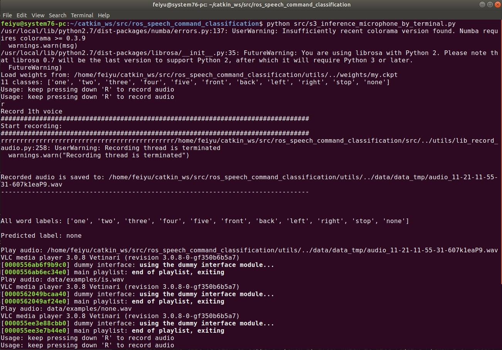
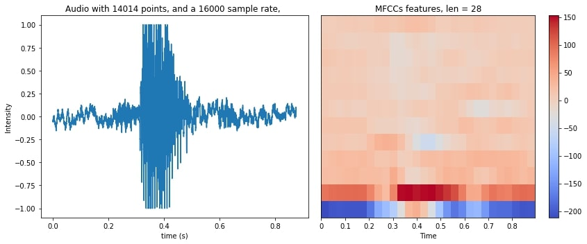
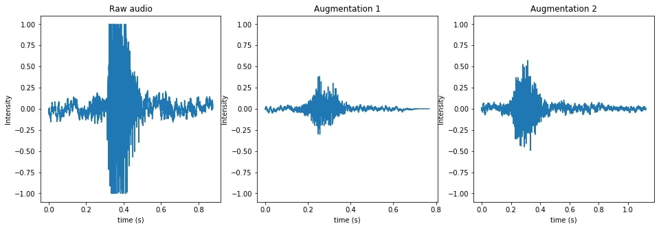

# ROS Package for Speech Commands Classification

**Workflow**:  
(1) Press `R` to record audio.  
(2) Speak a word to your laptop's microphone.   
(3) The program classifies your word, publishes result to ROS topic, and displays result on GUI.

**Classes:** 
`one, two, three, four, five, front, back, left, right, stop, none`

**GUI**:
<!--  -->

# 1. How to run


## 1.1. Install Dependencies

Install python libraries. 
* `pynput` is for keyboard I/O. 
* `soundfile`, `sounddevice`, `libsndfile1` is for audio I/O and audio processing.
* `librosa` is also for processing audios.
* `gtts` is for synthesizing audio.
```
$ sudo pip2 install matplotlib sklearn scipy numpy opencv-python jupyter future-fstrings
$ sudo pip2 install pynput soundfile sounddevice librosa gtts pyttsx pyttsx3  
```


Then, install `pytorch`: Please go to https://pytorch.org/ and install the one that matches with your computer. For me, I'm using the version: Stable(1.3), Linux, Pip, Python 2.7, CUDA 10.1:  
```
$ sudo pip install torch torchvision # or pip2
```

## 1.2. Download this project
Download to your ROS workspace:
```
$ cd ~/catkin_ws/src
$ git clone https://github.com/felixchenfy/ros_speech_commands_classification
$ cd ros_speech_commands_classification
$ export ROOT="$PWD"
```

## 1.3. Classify Audio from Microphone (ROS)

```
$ rosrun ros_speech_command_classification start_GUI_and_audio_classification.py
$ rostopic echo /ros_speech_commands_classification/predicted_label
$ rostopic echo /ros_speech_commands_classification/predicted_probability
```

After running the ROS Node, a GUI will pop out. Then, you need to:
* Click the GUI.
* Press the keyboard key `R` to start recording audio.
* Speak a word.
* Release `R` to stop recording.
* The result will be displayed on the GUI, and published to the ROS topics.

Please see [start_GUI_and_audio_classification.py](start_GUI_and_audio_classification.py) for more details.

A snapshot of the GUI is shown below.


## 1.4. Classify Audio from Microphone (not ROS)

* GUI version:
    ```
    $ python src/s4_inference_microphone_by_GUI.py
    ```
    The usage is the same as the ROS version.


* Terminal version:
    ```
    $ python src/s3_inference_microphone_by_terminal.py
    ```
    Instead of GUI, you need to press `R` inside the terminal. The result will be printed onto the terminal, as well as being shouted out by your laptop's speaker.   
    For example, if you said `one` but the program thinks it's `front`, then the speaker will say `one is front`.

    


## 1.5. Classify Audio Files
One audio file:
```
$ python src/s5_inference_audio_file.py --data_folder test_data/audio_front.wav
$ python src/s5_inference_audio_file.py --data_folder test_data/audio_three.wav
```

A folder of audios:
```
$ python src/s5_inference_audio_file.py --data_folder data/data_train/three
```
The audio file should end with `.wav`.

# 2. Train the Model

I will describe the procedures of how I trained this audio classifier.  

If you want to train your own model, change the classes in [config/classes.names](config/classes.names) and the data in [data/data_train/](data/data_train/), and run `python/src/s2_train_on_mine.py`. For more details, please see Section `2.2 Finetune on My Dataset`.


## 2.1. Pretrain on a Big Dataset


### 2.1.1. Download dataset
The LSTM model is pretrained on a public dataset called [Speech Commands Dataset](https://ai.googleblog.com/2017/08/launching-speech-commands-dataset.html), which has **105k** audio clips (3.3GB) and **35** classes.

Download this dataset from [here](
https://storage.cloud.google.com/download.tensorflow.org/data/speech_commands_v0.02.tar.gz). Unzip it, and copy it to the `${ROOT}/data/kaggle/` folder like this:  
```
data/kaggle/
├── backward
├── bed
├── bird
...
```

I used `kaggle` as folder name  because Kaggle once hold a competition using this dataset.

### 2.2.2. Train
In [src/s1_pretrain_on_kaggle.py](src/s1_pretrain_on_kaggle.py), the data folder and the classes have already been set:
```
args.data_folder = "data/kaggle/"
args.classes_txt = "config/classes_kaggle.names" 
```

**Data label format**: All audios of the label `cat` is put under the folder `data/kaggle/cat/`, and so does `dog`, `bird`, etc..

Start training:
```
$ python src/s1_pretrain_on_kaggle.py 
```

The model will be saved to `checkpoints/` after every epoch of training. The training settings and accuracy are also saved to the folder:
```
checkpoints/
├── fig.jpg
├── log.txt
├── 000.ckpt
├── 001.ckpt
├── 002.ckpt
...
```

The model converges after 25 epochs of about 15 hours.

Then, you need to move the checkpoint with highest accuracy, e.g. `checkpoints/023.ckpt`, to `weights/kaggle.ckpt`.

### 2.2.3. Result

* Settings
    ```
    num_epochs          : 25
    learning_rate       : 0.001
    train_eval_test_ratio: [0.9, 0.1, 0.0]

    aug = Aug([        
        Aug.Shift(rate=0.2, keep_size=False), 
        Aug.PadZeros(time=(0, 0.3)),
        Aug.Amplify(rate=(0.2, 1.5)),
        # Aug.PlaySpeed(rate=(0.7, 1.3), keep_size=False),
        Aug.Noise(noise_folder="data/noises/", 
                        prob_noise=0.7, intensity=(0, 0.7)),
    ], prob_to_aug=0.8)
    ```
* Result
    

* Analysis
    * Since epoch 23 gives the highest testing accuracy of 92.4%, the corresponding weight `checkpoints/023.ckpt` file is used for finetuning.

    * Testing accuracy is higher than training accuracy because the training set were data augmented and were harder to classify.
    * The optimizer is Adam, and its weight decay  should be set as 0, as described by some tutorial.

## 2.2 Finetune on My Dataset

### 2.2.1. Data and Pretrained Model

The training data ([data/data_train/](data/data_train/)) and the pretrained model ([weights/kaggle.ckpt](weights/kaggle.ckpt)) are already included in the repo.

**Labels**: See [config/classes.names](config/classes.names):
```
one
two
front
...
```

**Data label format**: All audios of the label `front` is put under the folder `data/data_train/front/`, and so does `one`, `two`, etc..

**How to record your own audios**:
```
python utils/lib_record_audio.py -h
python utils/lib_record_audio.py
```

Press key `R` to start recording. Recorded audio will be saved to: `data/data_tmp/*.wav`

### 2.2.2. Train
In [src/s2_train_on_mine.py](src/s2_train_on_mine.py), the (1) classes, (2) training data, and (3) pretrained model have been set as:
```
args.classes_txt = "config/classes.names" 
args.data_folder = "data/data_train/"
args.load_weight_from = "weights/kaggle.ckpt"
```

Start training:
```
python src/src/s2_train_on_mine.py
```


The model will be saved to `checkpoints/` after every epoch of training. The training settings and accuracy are also saved to the folder:
```
checkpoints/
├── fig.jpg
├── log.txt
├── 000.ckpt
├── 001.ckpt
├── 002.ckpt
...
```

The model converges after 10 epochs of about 2 minutes.

Then, you need to move the checkpoint with highest accuracy, e.g. `checkpoints/009.ckpt`, to `weights/my.ckpt`.

### 2.2.3. Result

* Settings
    ```
    num_epochs          : 10
    learning_rate       : 0.001
    train_eval_test_ratio: [0.7, 0.3, 0.0]

    aug = Aug([
        Aug.Shift(rate=0.2, keep_size=False), 
        Aug.PadZeros(time=(0, 0.3)),
        Aug.Amplify(rate=(0.5, 1.2)),
    ], prob_to_aug=0.8)
    ```

* Result
    
    Move the checkpoint with highest accuracy, i.e. `checkpoints/009.ckpt`, to `weights/my.ckpt`.


# 3. Algorithm  

# 3.1. Overview
**Feature:** MFCCs (Mel-frequency cepstral coefficients) are computed from the audio. You can think of this feature as the result of fouriour transformation. See [utils/lib_proc_audio.py](utils/lib_proc_audio.py)

**Classifier:** LSTM (Long Short-Term Memory). This is a type of Recurrent Neural Network. See [utils/lib_rnn.py](utils/lib_rnn.py).

**Pretrain**: The model was pretrained on the [Speech Commands Dataset](https://ai.googleblog.com/2017/08/launching-speech-commands-dataset.html) with intensive data augmentation techniques, including `shift`, `amplify`, `superpose noise`, etc.

**Finetune**: The model was then finetuned on my own dataset.
    
# 3.2. Feature
The [MFCCs](https://en.wikipedia.org/wiki/Mel-frequency_cepstrum) feature is computed and fed into the classifer. An intuitive understanding of MFCCs is: Use a sliding window on the raw data, and compute the fourior transform of each window to obtain the "loudness" on each frequency band.

The function for computing MFCCs is in [utils/lib_proc_audio.py](utils/lib_proc_audio.py):
``` python
def compute_mfcc(data, sample_rate, n_mfcc=12):
    return librosa.feature.mfcc(y=data, sr=sample_rate, n_mfcc=n_mfcc)
```

Test and plot:
> $ python test/test_lib_proc_audio.py



# 3.3. Data Augmentation

Raw data goes through a serials of augmentation before training, including:
- Shift
- Pad zeros
- Amplify
- Change play speed
- Superpose noise

This step is essential. Raw audios in Speech Commands Dataset are all about one second long, and have little background noise. It can easily cause overfitting. Thus, I augmented data by adding noise, change audio length, loudness, etc.

Example code of audio augmentation:
``` python
# Initialize the augmenter.
# Specify a parameter's range for generating a random augmentation.
Aug = lib_augment.Augmenter
aug = Aug([
    # shift data for 0~0.2 percent of the total length
    Aug.Shift(rate=(0, 0.2), keep_size=False),
    Aug.PadZeros(time=(0, 0.3)),  # pad zeros at one side for 0~0.3 seconds
    Aug.Amplify(rate=(0.2, 1.5)),  # amplify loudness by 0.2~1.5
    Aug.PlaySpeed(rate=(0.7, 1.3), keep_size=False),  # change play speed
    Aug.Noise(  # Superpose noise.
        # (Noise files are pre-load and normalized)
        noise_folder="data/noises/", prob_noise=1.0, intensity=(0, 0.7)),
], prob_to_aug=1.0,  # probability to do this augmentation
)

audio_1 = lib_datasets.AudioClass(filename="test_data/audio_front.wav")
audio_2 = copy.deepcopy(audio_1)
aug(audio_2)  # Augment audio.
audio_1.plot_audio(ax=plt.gca())
audio_2.play_audio()
audio_2.write_to_file("test_augment_result_2.wav")
```

Test file:
```
python test/test_lib_augment.py
```

Result:


# 3.4. Result  

The test accuracy is 92.4% on Speech Commands Dataset, with a random 0.9/0.1 train/test split.

The model was then finetuned and evaluated on my own dataset of 1378 samples, with all the parameters fixed except the last FC layer.  
The test accuracy is 100.0%, with a random 0.7/0.3 train/test split.   
This is kind of overfitting, because almost all the words(audio files) were spoken by me, which are similar to each other to some extent.

If you want to use this repo for your own course project, you may need to record audios of your own voice, and then train the model, as described in Section `2.2. Finetune on My Dataset`.


# Reference

* Record audio  
https://python-sounddevice.readthedocs.io/en/0.3.12/examples.html#recording-with-arbitrary-duration

* LSTM  
https://github.com/yunjey/pytorch-tutorial/blob/master/tutorials/02-intermediate/recurrent_neural_network/main.py

* How to augment audio data  
https://www.kaggle.com/CVxTz/audio-data-augmentation

